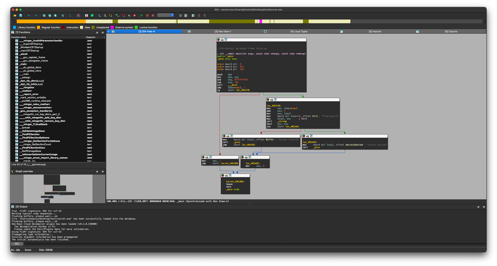
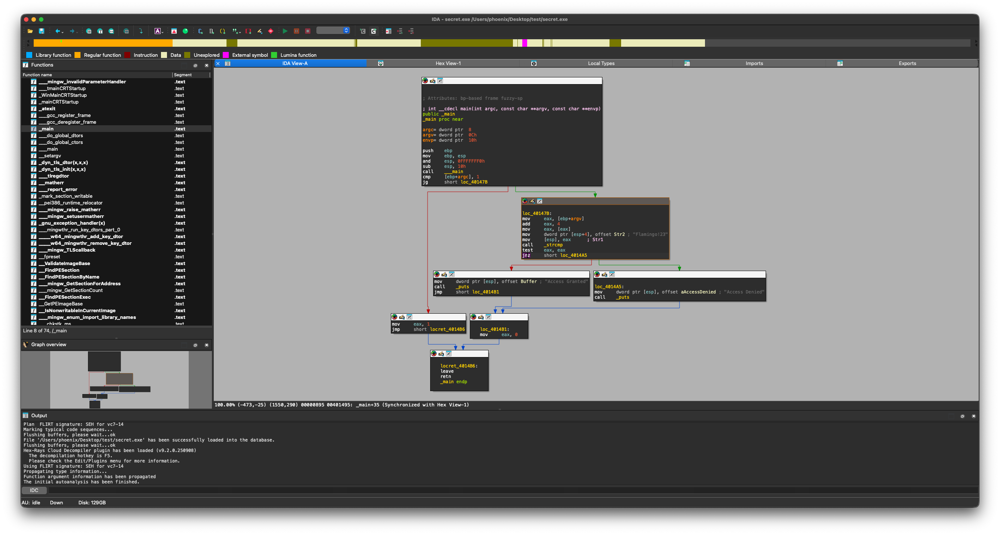
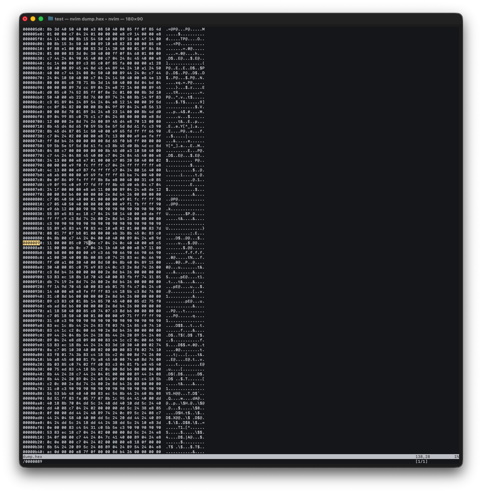
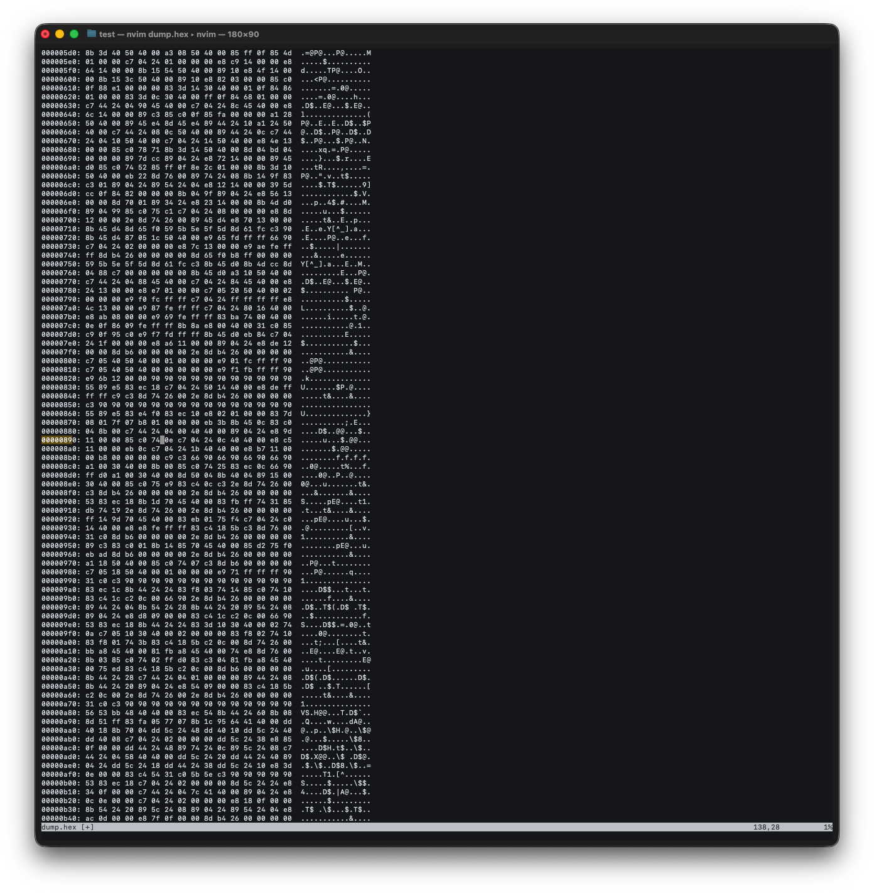

# Exercises: Architecture & Assembly

## Exercise 1: The "Secret" String

**Organization Note:**
*   Store your compiled binaries in the `challenges/` folder.
*   Save screenshots of your debugger/disassembler analysis in the `screenshots/` folder.

1.  **Setup:** Write a C program that takes a password as a command-line argument.
    ```c
    #include <stdio.h>
    #include <string.h>
    int main(int argc, char *argv[]) {
        if (argc < 2) return 1;
        if (strcmp(argv[1], "Flamingo!23") == 0) {
            printf("Access Granted\n");
        } else {
            printf("Access Denied\n");
        }
        return 0;
    }
    ```
2.  **Compile:**
    *   **Native (Windows/Linux):** `gcc secret.c -o secret.exe`
    *   **macOS (Cross-Compile):**
        ```bash
        brew install mingw-w64
        i686-w64-mingw32-gcc secret.c -o secret.exe
        ```
3.  **Task:** Open it in IDA/Ghidra.
    *   Can you find the `strcmp` call?
    *   Where is "Flamingo!23" stored? (Data section? Stack?)
    *   **Analysis Preview:**
        
        <details>
        <summary><strong>Reveal Analysis Answers</strong></summary>

        1.  **`strcmp` Call:** Found in the middle block (`call _strcmp`).
        2.  **String Storage:** "Flamingo!23" is stored in the **Data Section** (note the `offset` keyword, which indicates a static memory address).
        </details>
    *   **Challenge:** Patch the binary (using a hex editor) so that entering "WRONG" prints "Access Granted".
        <details>
        <summary><strong>Reveal Patching Solution</strong></summary>

        1.  **Locate the Jump:** Find the conditional jump instruction (`jnz` or `75`) immediately after the `strcmp` check.
        2.  **Find File Offset:** IDA shows *Virtual Addresses* (e.g., `00401495`). Hex Fiend needs the *File Offset* (e.g., `00000895`). In IDA, look at the bottom left status bar for `File Offset: ...` when you click the instruction.
            
        3.  **Edit Bytes:** Open the binary in Hex Fiend. Press **Command + L** (or Edit > Jump to Offset) and type the File Offset.
            
        4.  **The Patch:** Change `75` (JNZ) to `74` (JZ) to invert the logic, or replace the instruction with `90 90` (NOP) to ignore the check entirely.
            

        **Alternative: The CLI Way (`xxd`)**
        If you prefer the terminal:
        1.  **Dump:** `xxd -g 1 secret.exe > dump.hex`
        2.  **Edit:** Open `dump.hex` in any text editor (vim/nano). Search for the bytes you found in IDA (e.g., `75 XX`). Change `75` to `74`.
        3.  **Rebuild:** `xxd -r dump.hex > secret_patched.exe`
        4.  **Run:** `./secret_patched.exe`
        </details>

## Exercise 2: The Loop
1.  **Setup:** Write a C program with a `for` loop that performs an XOR operation on an array of numbers.
2.  **Task:** Open in a disassembler.
    *   Identify the loop counter (usually a register like `ECX` or a stack var).
    *   Identify the XOR instruction.
    *   **Challenge:** Reconstruct the C code primarily by looking *only* at the graph view, not the decompiler.
