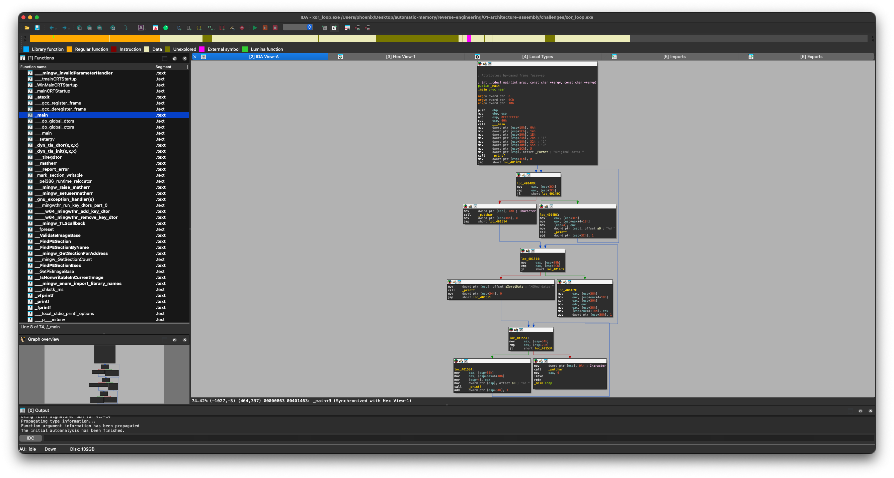

# Exercises: Architecture & Assembly

## Exercise 1: The "Secret" String

**Organization Note:**
*   Store your compiled binaries in the `challenges/` folder.
*   Save screenshots of your debugger/disassembler analysis in the `screenshots/` folder.

1.  **Setup:** Write a C program that takes a password as a command-line argument.
    ```c
    #include <stdio.h>
    #include <string.h>
    int main(int argc, char *argv[]) {
        if (argc < 2) return 1;
        if (strcmp(argv[1], "Flamingo!23") == 0) {
            printf("Access Granted\n");
        } else {
            printf("Access Denied\n");
        }
        return 0;
    }
    ```
2.  **Compile:**
    *   **Native (Windows/Linux):** `gcc secret.c -o secret.exe`
    *   **macOS (Cross-Compile):**
        ```bash
        brew install mingw-w64
        i686-w64-mingw32-gcc secret.c -o secret.exe
        ```
3.  **Task:** Open it in IDA/Ghidra.
    *   Can you find the `strcmp` call?
    *   Where is "Flamingo!23" stored? (Data section? Stack?)
    *   **Analysis Preview:**
        
        <details>
        <summary><strong>Reveal Analysis Answers</strong></summary>

        1.  **`strcmp` Call:** Found in the middle block (`call _strcmp`).
        2.  **String Storage:** "Flamingo!23" is stored in the **Data Section** (note the `offset` keyword, which indicates a static memory address).
        </details>
    *   **Challenge:** Patch the binary (using a hex editor) so that entering "WRONG" prints "Access Granted".
        <details>
        <summary><strong>Reveal Patching Solution</strong></summary>

        1.  **Locate the Jump:** Find the conditional jump instruction (`jnz` or `75`) immediately after the `strcmp` check.
        2.  **Find File Offset:** IDA shows *Virtual Addresses* (e.g., `00401495`). Hex Fiend needs the *File Offset* (e.g., `00000895`). In IDA, look at the bottom left status bar for `File Offset: ...` when you click the instruction.
            
        3.  **Edit Bytes:** Open the binary in Hex Fiend. Press **Command + L** (or Edit > Jump to Offset) and type the File Offset.
            
        4.  **The Patch:** Change `75` (JNZ) to `74` (JZ) to invert the logic, or replace the instruction with `90 90` (NOP) to ignore the check entirely.
            

        **Alternative: The CLI Way (`xxd`)**
        If you prefer the terminal:
        1.  **Dump:** `xxd -g 1 secret.exe > dump.hex`
        2.  **Edit:** Open `dump.hex` in any text editor (vim/nano). Search for the bytes you found in IDA (e.g., `75 XX`). Change `75` to `74`.
        3.  **Rebuild:** `xxd -r dump.hex > secret_patched.exe`
        4.  **Run:** `./secret_patched.exe`
        </details>

## Exercise 2: The Loop
1.  **Setup:** Write a C program with a `for` loop that performs an XOR operation on an array of numbers.
2.  **Compile:**
    *   **macOS (Cross-Compile):** `i686-w64-mingw32-gcc xor_loop.c -o xor_loop.exe`
3.  **Task:** Open in a disassembler.
    *   Identify the loop counter (usually a register like `ECX` or a stack var).
    *   Identify the XOR instruction.
    *   **Challenge:** Reconstruct the C code primarily by looking *only* at the graph view, not the decompiler.

<details>
<summary><strong>Reveal XOR Loop Solution Walkthrough</strong></summary>

### 1. Setup: C Program
We created a simple C program that iterates through an array of integers and XORs each element with a key (`0x55`).

**Source Code (`xor_loop.c`):**
```c
#include <stdio.h>

int main() {
    int data[] = {10, 20, 30, 40, 50};
    int key = 0x55;
    int length = 5;

    // ... print original ...

    // The loop to reverse engineer
    for (int i = 0; i < length; i++) {
        data[i] = data[i] ^ key;
    }

    // ... print result ...
    return 0;
}
```

### 2. Analysis: Graph View Reconstruction
When you open the compiled binary in a disassembler (like IDA, Ghidra, or Binary Ninja), the "Graph View" represents the control flow as nodes (basic blocks) and edges (jumps).



#### Identifying the Components

In our compiled assembly (ARM64), the relevant loop corresponds to the blocks `LBB0_5` through `LBB0_7`.

##### **Block A: Loop Header (Condition Check)**
*Corresponds to `LBB0_5` in the assembly.*
This block checks if the loop should continue.
*   **Assembly:**
    ```assembly
    ldr w8, [sp, #12]   ; Load variable 'i' (Counter)
    ldr w9, [sp, #20]   ; Load variable 'length'
    subs w8, w8, w9     ; Compare i - length
    b.ge LBB0_8         ; If i >= length, Exit Loop
    ```
*   **Graph Logic:** You will see a block with two outgoing arrows. One goes "Down" (True/Continue) to the body, and one goes "Side/Away" (False/Exit) to the rest of the program.
*   **Key Indication:** The `CMP` (or `SUBS` in ARM) instruction followed by a conditional branch (`B.GE`, `JGE`, etc.).

##### **Block B: Loop Body (The Logic)**
*Corresponds to `LBB0_6` in the assembly.*
This block performs the actual work.
*   **Assembly:**
    ```assembly
    ldrsw x8, [sp, #12]         ; Load 'i'
    add x9, sp, #32             ; Load address of 'data' array
    ldr w8, [x9, x8, lsl #2]    ; Load data[i]
    ldr w10, [sp, #24]          ; Load 'key' (0x55)
    eor w8, w8, w10             ; XOR operation (The Target!)
    str w8, [x9, x10, lsl #2]   ; Store result back to data[i]
    ```
*   **Graph Logic:** This block flows from the "Continue" arrow of the Header.
*   **Key Indication:** Look for the **`EOR`** (ARM) or **`XOR`** (x86) instruction. This answers the "Identify the XOR instruction" part of the task.

##### **Block C: Increment**
*Corresponds to `LBB0_7` in the assembly.*
This block updates the counter.
*   **Assembly:**
    ```assembly
    ldr w8, [sp, #12]   ; Load 'i'
    add w8, w8, #1      ; Increment 'i'
    str w8, [sp, #12]   ; Save 'i'
    b LBB0_5            ; Jump back to Header
    ```
*   **Graph Logic:** This block has a single outgoing arrow that loops **back** to the Header (Block A). This "back edge" is the visual definition of a loop in a graph.

### 3. Challenge: Reconstructing C Code

By observing only the graph structure:
1.  **Identify Loop:** You see a cycle: A -> B -> C -> A.
2.  **Identify Bounds:** Block A compares a variable (Counter) against a value (Limit).
3.  **Identify Action:** Block B loads a value from memory, performs an `XOR` with a constant (or another variable), and stores it back.
4.  **Identify Stride:** Block C increments the Counter by 1.

**Reconstructed Code:**
```c
// From Block A & C
for (int i = 0; i < length; i++) {
    // From Block B
    data[i] = data[i] ^ key;
}
```
</details>
