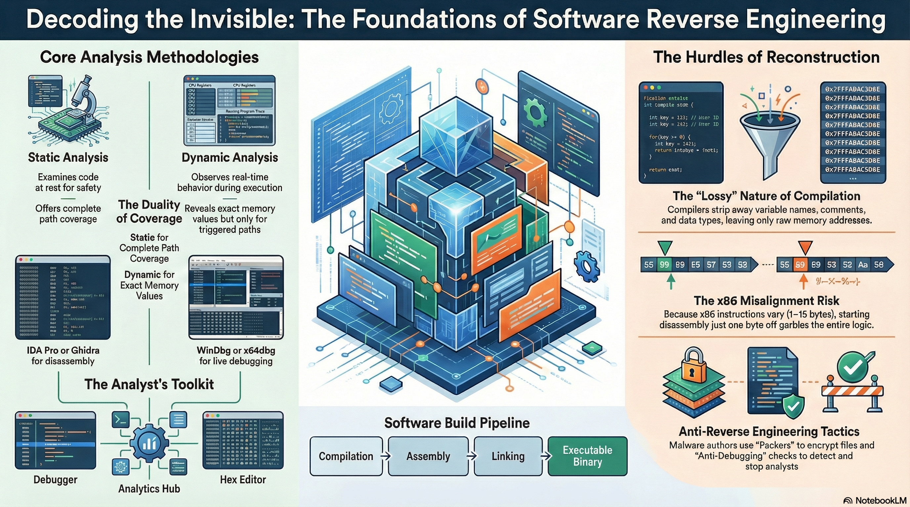

# Lesson 01: Introduction to Software Reverse Engineering

## Table of Contents

*   [Learning Objectives](#learning-objectives)
*   [1. What Is Reverse Engineering?](#1-what-is-reverse-engineering)
    *   [Primary Goals](#primary-goals)
*   [2. Core Analysis Methodologies](#2-core-analysis-methodologies)
    *   [Static Analysis](#static-analysis)
    *   [Dynamic Analysis](#dynamic-analysis)
*   [3. Technical Foundations](#3-technical-foundations)
    *   [Assembly Language](#assembly-language)
    *   [Target Architecture: x86 (Windows 32-bit)](#target-architecture-x86-windows-32-bit)
*   [4. The Analyst's Toolkit](#4-the-analysts-toolkit)
    *   [Static Analysis Tools](#static-analysis-tools)
    *   [Dynamic Analysis Tools](#dynamic-analysis-tools)
*   [5. The Software Build Process](#5-the-software-build-process)
    *   [C: Compilation, Assembly, Linking, Loading](#c-compilation-assembly-linking-loading)
*   [6. Why Reverse Engineering Is Hard](#6-why-reverse-engineering-is-hard)
    *   [What Gets Lost?](#what-gets-lost)
    *   [The Mapping Problem](#the-mapping-problem)
*   [7. Disassembly Algorithms](#7-disassembly-algorithms)
    *   [Linear Sweep (e.g., `objdump`, `WinDbg`)](#linear-sweep-eg-objdump-windbg)
    *   [Recursive Descent (e.g., `IDA Pro`)](#recursive-descent-eg-ida-pro)
*   [8. Anti-Reverse Engineering](#8-anti-reverse-engineering)
*   [9. Real-World Applications](#9-real-world-applications)
*   [Summary](#summary)
*   [Knowledge Check](#knowledge-check)
*   [Presentation Cliffnotes](#presentation-cliffnotes)

---

## Learning Objectives

By the end of this lesson, you will be able to:

*   Define **Reverse Engineering (RE)** and its primary goals in software analysis.
*   Distinguish between **Static Analysis** and **Dynamic Analysis**, and know when to apply each.
*   Explain the role of **Assembly Language** and the **x86 architecture** in the RE process.
*   Identify industry-standard tools such as **IDA Pro** and **WinDbg**.
*   Describe the **Software Build Process** (Preprocessing, Compilation, Assembly, Linking, Loading).
*   Understand the challenges posed by **compilation** and **optimization**.
*   Recognize common **anti-reverse engineering** techniques used by malware authors.

---

## Media Resources

[🎧 Listen to Audio](assets/01-intro-to-re.m4a)

[Lecture Slides: Introduction to Reverse Engineering](assets/01-intro-to-re.pdf)

## 1. What Is Reverse Engineering?

**Reverse Engineering (RE)** is the art of analyzing a system to understand how it works, often without access to the original documentation or source code. In the context of software, this means dissecting a compiled binary to reveal its internal logic, algorithms, and design.

While the term can apply to hardware or protocols, this course focuses on **software binaries**.

### Primary Goals

Why do we take apart software? The most common reasons include:

*   **Understanding Program Logic**: Figuring out "what does this button actually do?"
*   **Analyzing Protocols**: Deciphering undocumented network communications or file formats.
*   **Malware Analysis**: Dissecting malicious code to understand its infection methods, persistence strategies, and payload.
*   **Vulnerability Research**: Finding bugs and security flaws (like buffer overflows) that can be patched or exploited.

---

## 2. Core Analysis Methodologies

Reverse engineering typically involves two complementary approaches. A successful analyst uses both.

### Static Analysis

**Static Analysis** involves examining the binary **without executing it**. Think of this like reading a book or studying a blueprint. You are looking at the code instructions, data structures, and metadata sitting on the disk.

*   **Focus**: Disassembly, control flow graphs, string references, and imported functions.
*   **Pros**: Safe (code doesn't run), complete coverage (can see code paths that might not execute).
*   **Cons**: Can be easily confused by obfuscation; difficult to understand complex runtime behavior.
*   **Key Skill**: Reading **Assembly Language**.

**Note**: We will focus heavily on Static Analysis in the first half of this course.

### Dynamic Analysis

**Dynamic Analysis** involves **executing the program** and observing its behavior in real-time. This is like test-driving a car to see how it handles.

*   **Tools**: Debuggers (to step through code), network sniffers (Wireshark), and file/registry monitors.
*   **Pros**: You see exactly what values are in memory; obfuscation often breaks or reveals itself during execution.
*   **Cons**: Risky (malware could infect the analysis machine); incomplete coverage (you only see the code paths that actually trigger).

---

## 3. Technical Foundations

To reverse engineer software effectively, you must be comfortable with the low-level languages of the computer.

### Assembly Language

Binaries are machine code—streams of ones and zeros. **Assembly language** is the lowest human-readable representation of this machine code. Every instruction the processor executes (like "move data here" or "add these numbers") has an equivalent assembly mnemonic (e.g., `MOV`, `ADD`). Proficiency in reading assembly is the single most important skill for a reverse engineer.

### Target Architecture: x86 (Windows 32-bit)

While modern computers are 64-bit, we will focus on **32-bit Windows (x86)** architecture.
*   **Why?** It is still widely used in malware and legacy systems, and it is largely a subset of the more complex 64-bit architecture (x64).
*   **Variable Instruction Length**: Unlike RISC architectures (like ARM) where instructions are typically a fixed size (e.g., 4 bytes), x86 instructions can range from **1 to 15 bytes**. This makes correctly identifying where one instruction ends and the next begins a major challenge for disassemblers.

    **Examples of x86 Instruction Lengths:**

    | Hex Bytes | Assembly Instruction | Length |
    | :--- | :--- | :--- |
    | `90` | `NOP` (No Operation) | 1 Byte |
    | `50` | `PUSH EAX` | 1 Byte |
    | `B8 44 33 22 11` | `MOV EAX, 0x11223344` | 5 Bytes |
    | `81 C3 01 00 00 00` | `ADD EBX, 1` | 6 Bytes |
    | `0F 84 10 02 00 00` | `JZ <address>` | 6 Bytes |

    **The Disassembly Challenge (Misalignment):**
    If a disassembler starts reading just one byte off, the entire stream changes.
    *   **Original**: `B8 90 90 90 90` -> `MOV EAX, 0x90909090` (5 bytes)
    *   **Misaligned**: If we skip the `B8`, the disassembler sees four `90` bytes -> `NOP`, `NOP`, `NOP`, `NOP`.

*   **Transferability**: Once you master x86, transitioning to x64 or ARM is simply a matter of learning new registers and calling conventions.

---

## 4. The Analyst's Toolkit

You wouldn't be a surgeon without a scalpel. Here are the tools of the trade:

### Static Analysis Tools

*   **IDA Pro (Interactive Disassembler)**: The industry standard. It disassembles machine code and provides a powerful, interactive interface to map out control flow, rename variables, and comment on code.
*   **Ghidra**: A powerful, free, and open-source alternative developed by the NSA.

### Dynamic Analysis Tools

*   **WinDbg**: A powerful kernel-mode and user-mode debugger for Windows.
*   **x64dbg / Immunity Debugger**: User-friendly debuggers often used for malware analysis and exploit development.
*   **Features**: These allow you to set **breakpoints** (pause execution), inspect **registers/memory**, and trace the program's path.

---

## 5. The Software Build Process

To reverse engineer a program, we must first understand how it was constructed. The journey from human-readable source code to a running process involves several distinct stages.

### C: Compilation, Assembly, Linking, Loading

1.  **Preprocessing**: The preprocessor handles directives (like `#include` and `#define`). It expands macros and pulls in the contents of header files.
2.  **Compilation**: The compiler (e.g., GCC, Clang, MSVC) translates the preprocessed source code into **Assembly Language** specific to the target architecture (like x86). This is where high-level logic is transformed into low-level instructions.
3.  **Assembly**: An assembler translates the assembly code into **Machine Code** (binary instructions). The output is an **Object File** (e.g., `.obj` on Windows or `.o` on Linux), which contains machine code but is not yet a complete executable.
4.  **Linking**: The linker combines one or more object files with pre-compiled library code.
    *   **Static Linking**: Library code is copied directly into the final executable.
    *   **Dynamic Linking**: The executable contains "stubs" that point to external library files (like `.dll` or `.so`). The linker resolves external symbols and calculates the final memory layout of the file.
5.  **Loading**: When a user executes the file, the OS **Loader** takes over. It maps the file from disk into the process's virtual memory, sets up the stack and heap, resolves dynamic library addresses, and finally jumps to the program's **Entry Point** (often `main`).

---

## 6. Why Reverse Engineering Is Hard

If it were easy, everyone would do it. The primary difficulty stems from **Compilation Loss**.

When high-level source code (C, C++, Go) is compiled into machine code, the compiler optimizes it for the machine, not for humans. The process is **lossy**.

### What Gets Lost?

1.  **Names**: Variable names (`userPassword`), function names (`CheckLogin`), and comments are stripped away. You are left with memory addresses (e.g., `0x401000`).
2.  **Types**: Complex data structures (structs, classes) are flattened into raw bytes. You must infer that "these 4 bytes are an integer" and "those 4 bytes are a pointer."
3.  **Structure**: Loops and `if` statements are converted into simple `jump` and `compare` instructions.

### The Mapping Problem

There is a **many-to-many** relationship between source code and machine code.
*   Different source code can produce identical machine code (due to optimization).
*   The same source code can produce different machine code (depending on the compiler, flags, and OS).

---

## 7. Disassembly Algorithms

How do tools like IDA Pro turn raw bytes back into assembly instructions? Because x86 has **variable-length instructions**, a dissembler cannot simply "jump" to a fixed offset. It must decode each byte to determine the instruction's length before it knows where the next one starts.

They use one of two main algorithms:

### Linear Sweep (e.g., `objdump`, `WinDbg`)

*   **Method**: Starts at the beginning of the code section and decodes instructions one after another, linearly, until the end.
*   **Pros**: Fast and simple.
*   **Cons**: Prone to errors if **data** is mixed in with code (e.g., jump tables). It might try to interpret data bytes as instructions ("garbled code").

### Recursive Descent (e.g., `IDA Pro`)

*   **Method**: Follows the control flow. It starts at the entry point and follows jumps and calls to discover code.
*   **Pros**: Much more accurate; distinguishes code and data well.
*   **Cons**: Can miss code that is only reached via "indirect" jumps (computed at runtime) or obfuscated paths.

---

## 8. Anti-Reverse Engineering

Malware authors and software protection schemes actively try to stop you.

*   **Packers**: These compress or encrypt the executable file. The malicious code only "unpacks" itself in memory when run, hiding it from static analysis on disk.
*   **Obfuscation**: Deliberately turning simple code into spaghetti code. This involves inserting "junk code" (instructions that do nothing) or using opaque predicates (logic puzzles) to confuse the analyst.
*   **Anti-Debugging**: Code checks if a debugger is attached (e.g., `IsDebuggerPresent()`) and terminates or behaves differently if it detects one.

---

## 9. Real-World Applications

*   **Malware Analysis**: Dissecting a new ransomware strain (like **CryptoLocker**) to find a "kill switch" or write a decryptor. Often, analysts focus only on specific parts, like the Domain Generation Algorithm (DGA) used for C2 communication.
*   **Software Interoperability**: Reverse engineering a proprietary file format (like `.doc` before it was open) to allow open-source tools to read/write it.
    *   **The Problem**: A company keeps a file format secret (proprietary) to lock users into their software.
    *   **The Solution**: Reverse engineers analyze the raw bytes to deduce the pattern (e.g., "Byte 5 is font size").
    *   **The Result**: Open-source tools (like **LibreOffice**) can now open those files, or network tools (like **Samba**) can talk to Windows machines.
*   **Legacy Maintenance**: Fixing bugs in old software for which the source code has been lost.

---

## Summary

Reverse Engineering is a challenging but rewarding discipline that combines low-level technical knowledge with investigative reasoning. By mastering assembly language, understanding compiler behavior, and becoming proficient with tools like IDA Pro and debuggers, you gain the superpower to understand any software, regardless of whether you have the source code.

---

## Knowledge Check

1.  **Which analysis method is safer when dealing with unknown malware?**
    

    
Answer

    Static Analysis (because the code is not executed).

    

2.  **What is the "primary loss" during the compilation process that makes RE difficult?**
    

    
Answer

    Contextual information like variable names, function names, and data types.

    

3.  **Why might a Linear Sweep disassembler fail on complex binaries?**
    

    
Answer

    It can misinterpret data (like jump tables) as executable code because it disassembles sequentially without following control flow.

    

4.  **Why is x86 (32-bit) architecture the primary focus for learning reverse engineering?**
    

    
Answer

    It is the foundation for modern systems, still widely used in malware, and easier to learn than x64 while being transferable to other architectures.

    

5.  **Which disassembly algorithm is generally more accurate but slower, and why?**
    

    
Answer

    Recursive Descent. It follows the control flow (jumps/calls) to discover code, making it better at distinguishing code from data, though it can miss indirect jumps.

    

6.  **What is the purpose of a "packer" in malware?**
    

    
Answer

    To compress or encrypt the malicious payload so it remains hidden from static analysis tools until it is executed and "unpacked" in memory.

    

7.  **What is a significant disadvantage of Dynamic Analysis compared to Static Analysis?**
    

    
Answer

    It offers incomplete coverage; you only analyze the code paths that are actually triggered during execution, potentially missing dormant malicious logic.

    

8.  **What is a Domain Generation Algorithm (DGA) and why is it used?**
    

    
Answer

    A DGA automatically generates valid domain names for C2 (Command & Control) communication. It is used to evade static blacklisting; if defenders block one domain, the malware can simply generate and switch to a new one.

    

9.  **How can defenders detect or defend against DGA-based communication?**
    

    
Answer

    Defenders can analyze DNS traffic or proxy logs for high volumes of **NXDOMAIN** (non-existent domain) responses. This occurs because the DGA generates thousands of potential domains, but the attacker only registers a few. When the malware tries to connect to the unregistered ones, the DNS check fails. Additionally, by reverse engineering the DGA algorithm, security teams can predict future domains and preemptively block (blackhole) them.

    

10. **Explain the difference between Linking and Loading in the build process.**
    

    
Answer

    **Linking** happens at build-time (by the developer); it combines object files into an executable and resolves references to library code. **Loading** happens at run-time (by the OS); it maps the executable into memory, handles dynamic links, and prepares the program for execution.

    

11. **Why does the "variable length" of x86 instructions make disassembly difficult?**
    

    
Answer

    In x86, instructions can be anywhere from 1 to 15 bytes long. A disassembler cannot simply skip forward by a fixed amount; it must decode each instruction to figure out where the next one starts. If it starts decoding at the wrong offset (e.g., in the middle of an instruction or in a data section), it will produce "garbled" code that doesn't reflect the actual program logic.

    

---

## Presentation Cliffnotes

*   **The Elevator Pitch (Software Forensics)**:
    *   Reverse Engineering (RE) is the process of analyzing a system's internal structure and logic without access to the original source code or blueprints.
    *   Think of it as **Digital Archaeology**: we find the "artifacts" (binaries) and work backward to reconstruct the "civilization" (the original intent and algorithms of the developer).
    *   It is a critical skill for security researchers, malware analysts, and software engineers working with legacy systems.

*   **The Key Duality: Static vs. Dynamic Analysis**:
    *   **Static Analysis**: This is the "Reading Phase." We examine the binary's code (disassembly) and data structures while the program is at rest. It provides **safe** and **complete coverage** of all potential code paths but can be defeated by encryption or complex obfuscation.
    *   **Dynamic Analysis**: This is the "Observation Phase." We run the program in a controlled environment (debugger) and watch how it interacts with memory, the CPU, and the OS. It reveals **real-time behavior** and bypasses many static protections, but it only shows the code paths that are actually executed.

*   **The "Lossy" Nature of Compilation**:
    *   When high-level code (C/C++) is compiled, the "human side" is stripped away.
    *   **What disappears?** Variable names, function names, comments, and high-level logic structures (like classes and complex loops).
    *   **The Mapping Problem**: There isn't a 1-to-1 map between source code and machine code. Compilers optimize code for performance, which can make two very different source snippets look identical in assembly.

*   **The Software Build Pipeline (The "How It's Made")**:
    *   **Preprocessing**: Handling `#include` and `#define` (expanding the code).
    *   **Compilation**: Turning logic into architecture-specific **Assembly Language**.
    *   **Assembly**: Converting those mnemonics into raw **Machine Code** (Object files).
    *   **Linking**: Combining object files and libraries into a final **Executable**.
    *   **Loading**: The OS loader bringing the file into virtual memory for execution.

*   **The x86 Instruction Quirk (Variable Length)**:
    *   Unlike many modern architectures, x86 instructions are **not a fixed size**; they can be anywhere from 1 to 15 bytes long.
    *   **The Danger of Misalignment**: If a disassembler starts reading even one byte off—perhaps by mistaking data for code—it will completely misinterpret the instruction stream. This is why tools like IDA Pro use "Recursive Descent" to follow control flow rather than just reading linearly.

*   **Real-World Drivers (The "Why")**:
    *   **Malware Analysis**: Understanding a virus to build a signature or find a kill-switch.
    *   **Vulnerability Research**: Finding "Zero Days" (unpatched bugs) by spotting logic errors in memory handling.
    *   **Interoperability**: Figuring out how a secret file format works so you can build a competing or compatible product.
    *   **Legacy Maintenance**: Keeping critical 20-year-old systems running when the original team and source code are long gone.

*   **The Analyst's "Gold Standard" Toolkit**:
    *   **IDA Pro / Ghidra**: For deep-dive static analysis and graph-based visualization.
    *   **WinDbg / x64dbg**: For real-time debugging, setting breakpoints, and memory inspection.

