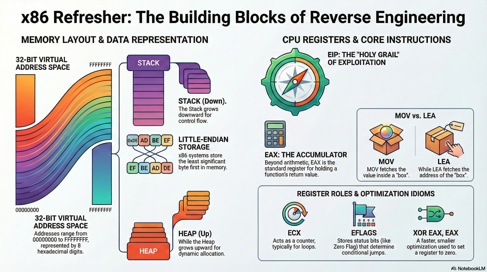

# Lesson 04: x86 Refresher

## Table of Contents

- [Learning Objectives](#learning-objectives)
- [Media Resources](#media-resources)
- [1. Memory Management in 32-bit Systems](#1-memory-management-in-32-bit-systems)
- [2. Data Representation and Opcodes](#2-data-representation-and-opcodes)
- [3. Key x86 Registers](#3-key-x86-registers)
- [4. Assembly Instructions](#4-assembly-instructions)
- [5. Practical Workflow: Compiling and Analyzing](#5-practical-workflow-compiling-and-analyzing)
- [Summary](#summary)
- [Knowledge Check](#knowledge-check)
- [Presentation Cliffnotes](#presentation-cliffnotes)

## Learning Objectives

By the end of this lesson, you will be able to:

*   Explain **Memory Management** in 32-bit systems, specifically the difference between Stack and Heap.
*   Understand data representation concepts like **Endianness** and **Opcodes**.
*   Identify key **x86 Registers** (EAX, ECX, EFLAGS, EIP) and their specific purposes.
*   Recognize essential **Assembly Instructions** (MOV, LEA, XOR, SHL/SHR).
*   Describe the practical workflow of **compiling C code** and analyzing it in **IDA Pro**.

---

## Media Resources

[🎧 Listen to Audio](assets/04-x86-refresher.m4a)

[Lecture Slides: x86 Refresher](assets/04-x86-refresher.pdf)

---

## 1. Memory Management in 32-bit Systems

Understanding how a program is mapped into memory is crucial for analysis.

### Virtual Address Space
In a 32-bit environment, addresses are 32 bits (4 bytes) long, represented as 8 hex digits ranging from `00000000` to `FFFFFFFF`.

### Stack vs. Heap
*   **Stack**: Used for control flow, local variables, and function arguments. It grows **downward** (from higher addresses to lower addresses).
*   **Heap**: Used for dynamically allocated memory (e.g., `malloc` or `new`). It grows **upward** (from lower to higher addresses) to maximize available space.

---

## 2. Data Representation and Opcodes

### Endianness
The order in which bytes are stored impacts analysis.
*   **Little-endian**: Stores the **least significant byte** first (e.g., Intel x86).
*   **Big-endian**: Stores the **most significant byte** first (e.g., Network traffic, PowerPC).

IDA Pro generally detects and displays this correctly, but manual byte reordering may sometimes be necessary.

### Opcodes
Opcodes are the binary/machine code representations of instructions.
*   Example: The opcode `55` represents `push EBP`.
*   **Relevance**: While you usually read assembly, knowing opcodes is critical for tasks like writing shellcode or exploiting vulnerabilities.

---

## 3. Key x86 Registers

Registers are small, high-speed storage locations within the CPU.

### General Purpose Registers
*   **EAX (Accumulator)**: Used for arithmetic and logical operations. **Crucially**, it holds the **return value** of function calls.
*   **ECX (Counter)**: Typically used as a loop counter.
*   **ESI / EDI**: Source Index and Destination Index, used for data transfer operations.

### Control and Status Registers
*   **EFLAGS**: A 32-bit register where individual bits (flags) indicate the result of operations (e.g., Zero Flag, Carry Flag). These flags determine whether conditional jumps are taken.
*   **EIP (Instruction Pointer)**: Holds the address of the **next instruction** to be executed. Controlling EIP is the "Holy Grail" of exploitation (e.g., buffer overflows).

---

## 4. Assembly Instructions

### Data Movement
*   **MOV**: Moves data between registers, memory, and immediate values.
    *   `MOV EAX, 1` (Put 1 into EAX)
*   **LEA (Load Effective Address)**: Moves a calculated **address** into the destination, NOT the value at that address.
    *   `LEA EAX, [EBP-4]` (Put the address of variable `var_4` into EAX). Useful for pointer arithmetic.

### Arithmetic & Logic
*   **ADD / SUB / MUL / DIV**: Standard math operations. Division often uses EDX:EAX for the result.
*   **XOR**: Exclusive OR.
    *   **Idiom**: `XOR EAX, EAX` is a standard way to set a register to **zero** (more efficient than `MOV EAX, 0`).
*   **SHL / SHR (Shift)**: Move bits left or right (multiplies/divides by 2).
*   **ROL / ROR (Rotate)**: Shift bits but wrap them around the register.

---

## 5. Practical Workflow: Compiling and Analyzing

The bridge from source code to assembly involves several steps:

### Compilation
Using tools like the Visual Studio `cl` compiler, C source code is transformed into an executable. This creates an intermediate object file before linking into the final binary.

### Compiler Optimization
Compilers are smart. They often pre-calculate values to save time at runtime.
*   *Example*: Source code `int x = 1 + 2;` might compile directly to `MOV EAX, 3`. The addition instruction never exists in the binary. This "loss" of logic is exactly why RE is widely considered an art.

### IDA Pro Navigation
*   **Prologue/Epilogue**: Standard code sequences that set up and tear down the stack frame for a function.
*   **Variable Renaming**: You will see generic names like `var_4` (offset -4 from base pointer). Renaming these to logical names (e.g., `sum`, `counter`) is essential for understanding.
*   **Tracing**: Highlighting a register in IDA allows you to trace its usage backwards, helping you find where a specific value originated.

---

## Summary

This refresher covered the bedrock of x86 reverse engineering. From the downward-growing stack to the critical role of EAX in function returns, these concepts are the "vocabulary" you will use to read binary code. Whether you are analyzing simple logic or complex changes introduced by compiler optimizations, a solid grasp of registers and memory layout is your most valuable tool.

---

## Knowledge Check

1.  **Which register typically holds the return value of a function?**
    

    
Answer

    **EAX**.
    

2.  **Does the Stack grow upward (to higher addresses) or downward (to lower addresses)?**
    

    
Answer

    **Downward** (towards lower memory addresses).
    

3.  **What is the difference between `MOV` and `LEA`?**
    

    
Answer

    `MOV` copies **data** (the value). `LEA` calculates and copies an **address** (the pointer).
    

4.  **Why do analysts often see `XOR EAX, EAX` in the code?**
    

    
Answer

    It is a highly efficient way to set the EAX register to **zero**.
    

5.  **Which 32-bit register is typically used as a loop counter?**
    

    
Answer

    **ECX**.
    

6.  **In a Little-Endian system, how would the hexadecimal value `0x12345678` be stored in memory?**
    

    
Answer

    `78 56 34 12` (Least Significant Byte first).
    

7.  **What is the specific purpose of the EIP register?**
    

    
Answer

    It holds the address of the **next instruction** to be executed.
    

8.  **If a C program has `int x = 5 + 5;`, why might you see `MOV EAX, 0xA` in the assembly instead of an `ADD` instruction?**
    

    
Answer

    Because of **Compiler Optimization**, where the compiler pre-calculates static values at compile time to improve runtime performance.
    

---

## Presentation Cliffnotes

*   **Stack vs. Heap Visual**: Use the "Stack of Plates" analogy for the Stack (LIFO) and a "Free-form Cloud" for the Heap. Emphasize that the Stack grows *down* (towards 0), like digging a hole, while the Heap grows *up*.
*   **Endianness Trick**: "Little Endian" = "Little End First". The smallest unit (least significant byte) is at the start.
*   **The "Holy Grail" Register**: When discussing EIP, pause and emphasize it. Controlling EIP means controlling execution. This is the bridge to exploit development.
*   **MOV vs. LEA**: This is the most common point of confusion.
    *   **MOV**: "Give me what is *inside* the box."
    *   **LEA**: "Give me the *address* of the box."
*   **XOR Zeroing**: Ask the class why compilers use `XOR EAX, EAX` instead of `MOV EAX, 0`. (Answer: It's smaller and faster). It's a great example of compiler optimization they will see everywhere.
*   **The "Lossy" Nature of Compilation**: Show the `int x = 1 + 2` -> `MOV EAX, 3` example. Reinforce that we are looking at the *result* of the code, not the original source code.
