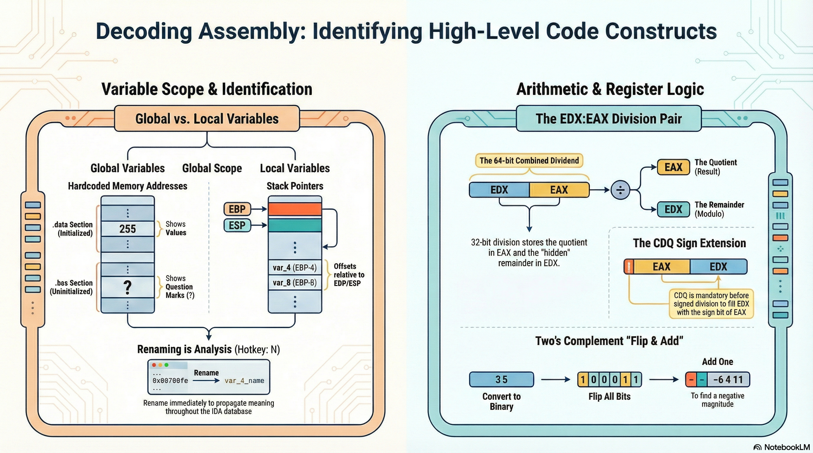

# Lesson 05: Code Constructs

## Table of Contents

- [Learning Objectives](#learning-objectives)
- [Media Resources](#media-resources)
- [1. Goals of Binary Analysis](#1-goals-of-binary-analysis)
- [2. Variable Scope and Identification in IDA](#2-variable-scope-and-identification-in-ida)
- [3. Practical Analysis Techniques](#3-practical-analysis-techniques)
- [4. Arithmetic and Register Manipulation](#4-arithmetic-and-register-manipulation)
- [5. Two's Complement Refresher](#5-twos-complement-refresher)
- [Summary](#summary)
- [Knowledge Check](#knowledge-check)
- [Presentation Cliffnotes](#presentation-cliffnotes)

## Learning Objectives

By the end of this lesson, you will be able to:

*   Explain the **goals of binary analysis** when source code is unavailable.
*   Distinguish between **Global** and **Local** variables and identify them in IDA Pro.
*   Apply practical analysis techniques such as **renaming variables** and **identifying standard library functions**.
*   Understand **arithmetic operations** at the assembly level, specifically division and sign extension (`CDQ`).
*   Perform **Two's Complement** calculations to verify negative values.

---

## Media Resources

[🎧 Listen to Audio](assets/05-code-constructs.m4a)

[Lecture Slides: Code Constructs](assets/05-code-constructs.pdf)

---

## 1. Goals of Binary Analysis

The primary goal of this lesson is to teach you how to analyze unknown binaries to determine their functionality and purpose without access to the original source code.

*   **Micro vs. Macro**: While you must initially examine code instruction-by-instruction to understand compiler behavior, the ultimate goal is to identify "big picture" functionality (e.g., "This function modifies the registry" or "This function opens a network socket") rather than getting lost in every single line of assembly.

---

## 2. Variable Scope and Identification in IDA

Distinguishing between variable types is a fundamental skill in reverse engineering.

### Global Variables
*   **Definition**: Variables accessible throughout the entire program.
*   **Location**: Typically defined in the `.data` (initialized) or `.bss` (uninitialized) sections.
*   **Identification**: Referenced by a hardcoded memory address (e.g., `mov eax, dword_414000`).
*   **Visuals**:
    *   **Initialized**: You will see their data value immediately (e.g., `255`).
    *   **Uninitialized**: You will see a question mark (`?`) in the data section.

### Local Variables
*   **Definition**: Variables accessible only within a specific function or block.
*   **Location**: Typically stored on the **Stack**.
*   **Identification**: Referenced using offsets relative to the Base Pointer (**EBP**) or Stack Pointer (**ESP**) (e.g., `ebp - 4` or `esp + 8`).
*   **Note**: Compiler optimizations may sometimes place local variables directly into **registers** instead of the stack.

---

## 3. Practical Analysis Techniques

### Renaming
*   **Hotkey**: `N`
*   **Best Practice**: As soon as you identify the purpose of a variable (e.g., a loop counter or a username buffer), rename it. This propagates the meaning throughout the entire IDA database, making the overall flow much easier to understand.

### Identifying Standard Functions
*   **Context Clues**: You can often identify standard library calls (like `printf` or `scanf`) by looking at the arguments pushed onto the stack *before* the call.
*   **Example**: If you see an instruction pushing an offset to a string format like `"%d"`, the subsequent `call` is almost certainly `printf` or `scanf`.

---

## 4. Arithmetic and Register Manipulation

### Division (`div` / `idiv`)
Division involves specific register pairs depending on operand size. For 32-bit operations:
*   The instruction divides the 64-bit value in **EDX:EAX** by the operand.
*   **Quotient**: Stored in **EAX**.
*   **Remainder**: Stored in **EDX**.

### Sign Extension (`CDQ`)
The `CDQ` (Convert Double to Quad) instruction is critical for **signed division**.
*   **Function**: It sign-extends **EAX** into **EDX**. This means it fills EDX with the sign bit of EAX (0s for positive, 1s for negative).
*   **Why it matters**:
    *   **Positive Numbers**: EDX must be zeroed out manually before division.
    *   **Negative Numbers**: Simply moving a value into EAX is not enough. You must use `CDQ` to ensure EDX has the correct sign bits, otherwise, the division result will be incorrect.

---

## 5. Two's Complement Refresher

Two's Complement is the standard method for representing negative integers in binary.

### How to Convert (Negative Hex to Decimal)
1.  **Binary**: Convert the hex digits to binary.
2.  **Invert**: If the most significant bit is 1 (indicating a negative number), flip all bits (0 becomes 1, 1 becomes 0).
3.  **Add One**: Add 1 to the result. This gives you the magnitude of the negative number.

---

## Summary

In this lesson, we moved from basic instructions to recognizing higher-level code constructs. By learning to distinguish global from local variables and understanding the nuances of signed arithmetic instructions like `CDQ`, you are building the mental model necessary to reconstruct the original programmer's intent from raw assembly.

---

## Knowledge Check

1.  **Where are Global Variables typically stored?**
    

    
Answer

    In the `.data` (initialized) or `.bss` (uninitialized) sections.
    

2.  **What instruction is often used before valid signed division to set up the EDX register?**
    

    
Answer

    `CDQ` (Convert Double to Quad).
    

3.  **If `div` is executed, where is the Remainder stored?**
    

    
Answer

    In the **EDX** register.
    
    

4.  **How are Local Variables typically referenced in assembly?**
    

    
Answer

    By offsets relative to the Base Pointer (`EBP`) or Stack Pointer (`ESP`), e.g., `[EBP-4]`.
    

5.  **What does a question mark (`?`) in the `.data` section signify?**
    

    
Answer

    It signifies an **Uninitialized** variable.
    

6.  **If you see `mov eax, dword_402000`, what type of variable is likely being accessed?**
    

    
Answer

    A **Global Variable** (referenced by a hardcoded memory address).
    

7.  **In Two's Complement, what is the shortcut to find the magnitude of a negative number?**
    

    
Answer

    **Invert all bits** and **add 1**.
    

8.  **Why is renaming variables in IDA Pro considered a "Best Practice"?**
    

    
Answer

    It propagates the meaning of the variable throughout the entire database, making the overall control flow and logic much easier to understand.
    

---

## Presentation Cliffnotes

*   **Global vs. Local Analogy**:
    *   **Global**: Like a "Public Notice Board" at a fixed location (hardcoded address). Everyone knows where it is.
    *   **Local**: Like a "Sticky Note" on your desk (Stack). It's temporary and relative to where *you* are sitting (EBP).
*   **The "CDQ" Gotcha**: This is a high-value teaching point. If they miss the `CDQ` instruction before a division, their analysis of any signed math operations will be incorrect. It's a subtle but critical detail.
*   **Modulo Operator**: Remind them that in programming, `%` (modulo) gives the remainder. In assembly `DIV`, the remainder is "hidden" in **EDX**.
*   **Two's Complement "Flip & Add"**: Drill this mechanic. "Flip the bits, Add one." It's the standard way to verify if that large hex number (`0xFFFFFFFB`) is actually just `-5`.
*   **Renaming IS Analysis**: Reiterate this core philosophy. "An unnamed variable is an unanalyzed variable." usage of `N` hotkey should be muscle memory.
