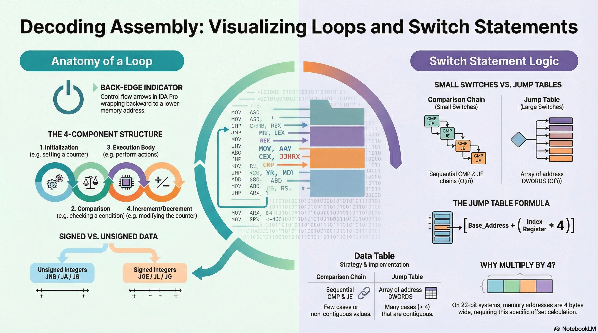

# Lesson 07: Code Constructs: Loops and Jump Tables

## Table of Contents

- [Learning Objectives](#learning-objectives)
- [Media Resources](#media-resources)
- [1. Analyzing Loops in Disassembly](#1-analyzing-loops-in-disassembly)
- [2. Switch Statements and Jump Tables](#2-switch-statements-and-jump-tables)
- [Knowledge Check](#knowledge-check)
- [Presentation Cliffnotes](#presentation-cliffnotes)

## Learning Objectives

By the end of this lesson, you will be able to:

*   Identify **Loop Structures** within disassembly using visual indicators and control flow patterns.
*   Deconstruct a `for` loop into its four assembly components: **Initialization**, **Comparison**, **Body**, and **Increment**.
*   Differentiate between **Signed** and **Unsigned** comparisons to infer data types in loops.
*   Distinguish between **Comparison Chains** (small switches) and **Jump Tables** (large switches).
*   Explain the mechanism of a **Jump Table** calculation `(Base + Index * 4)`.

---

## Media Resources

[🎧 Listen to Audio](assets/07-code-constructs-loops.m4a)



[Lecture Slides: Code Constructs: Loops and Jump Tables](assets/07-code-constructs-loops.pdf)

---

## 1. Analyzing Loops in Disassembly

High-level languages have various loop types (for, while, do-while), but in assembly, identifying the *structure* is more important than the specific keyword.

### Visual Identification
*   **The "Back-Edge"**: The primary indicator of a loop in IDA Pro is a control flow arrow that wraps **backward** from a higher memory address to a lower one.

### Structure of a For Loop
A standard `for` loop breaks down into four main components visible in assembly:

1.  **Init (Initialization)**: Setting a counter variable (e.g., `MOV EAX, 0`).
2.  **Compare (Comparison)**: Checking the counter against a limit (e.g., `CMP EAX, 0A`).
3.  **Body (Execution)**: The code instructions that perform the work inside the loop.
4.  **Increment/Decrement**: Modifying the counter (e.g., `INC EAX` or `ADD EAX, 1`) before jumping back to the Comparison step.

### While Loops
These are often used when waiting for a specific condition rather than a count.
*   *Example*: A loop that checks if a variable `x > 0`. It executes the body and decrements `x` internally, jumping back only if the condition is still met.

### Insight on Data Types
The specific conditional jump used tells you about the variable type:
*   **Unsigned Integers**: Indicated by `JNB` (Jump if Not Below) or `JA/JB`.
*   **Signed Integers**: Indicated by `JGE`, `JL`, or `JG`.

---

## 2. Switch Statements and Jump Tables

Compilers choose different assembly strategies for `switch` statements based on efficiency.

### Type A: Small Switches (Comparison Chains)
Used for switches with few cases or non-contiguous values.
*   **Mechanism**: A series of `CMP` and `JE` (Jump if Equal) instructions.
*   **Flow**: Comparing input vs Case 1 -> Jump if True -> Else compare vs Case 2...
*   **Analogy**: It functions exactly like a series of `if-else if` statements.

### Type B: Large Switches (Jump Tables)
Used for switches with many cases (e.g., > 4) that are relatively contiguous (0, 1, 2, 3...).

**How it works:**
1.  **Default Check**: First, the code compares inputs against the *maximum* case value. If higher, it jumps immediately to the `default` case.
2.  **The Jump Table**: An array of addresses (DWORDS) stored in the data section.
3.  **Address Calculation**: The program calculates where to jump using the input as an index.

**The Formula**:
```assembly
JMP [Base_Address + (Register * 4)]
```
*   **Base_Address**: The start of the jump table array.
*   **Register**: The switch variable (0, 1, 2...).
*   **Multiplication by 4**: Because each address in 32-bit architecture is **4 bytes** long.

**Benefit**: This allows "O(1)" constant time access. The program jumps directly to `Case 100` without checking Cases 0-99 first.

---

## Knowledge Check

1.  **What is the primary visual indicator of a loop in IDA Pro's graph view?**
    <details>
    <summary>Answer</summary>

    A control flow arrow pointing **backward** (from a lower address to a higher address).
    
    </details>

2.  **If a loop compares a variable using `JNB` (Jump Not Below), is the variable Signed or Unsigned?**
    <details>
    <summary>Answer</summary>

    **Unsigned**. Signed comparisons would use `JGE` (Greater or Equal).

    </details>

3.  **Why do Jump Table calculations multiply the index by 4?**
    <details>
    <summary>Answer</summary>
    
    Because on a 32-bit system, memory addresses are **4 bytes** wide. The multiplication converts the index (0, 1, 2) into a byte offset (0, 4, 8).

    </details>

4.  **True or False: A "Comparison Chain" switch statement checks every case sequentially.**
    <details>
    <summary>Answer</summary>

    **True**. It compares against the first case, then the second, and so on, which is slower for large sets than a Jump Table.

    </details>

5.  **What are the four components of a standard `for` loop in assembly?**
    <details>
    <summary>Answer</summary>
    **Initialization**, **Comparison**, **Body**, and **Increment**.
    </details>

6.  **In a Jump Table switch, where does the code jump if the input is greater than the highest case?**
    <details>
    <summary>Answer</summary>
    It jumps to the **Default** case.
    </details>

---

## Presentation Cliffnotes

*   **The "Blue Arrow Up"**: In IDA Graph view, the most reliable sign of a loop is the blue line going *backwards* (up) to an earlier address.
*   **Loop Components**: Drill the "Init -> Compare -> Body -> Increment" structure. If they can identify these 4 parts, they can reconstruct the original loop.
*   **Switch Optimization**: Explain *why* compilers switch strategies.
    *   **Few Cases**: `CMP/JE` chains are simple.
    *   **Many Cases**: A Jump Table (O(1)) is faster than checking 50 `if` statements (O(n)).
*   **The "Times 4" Mystery**: When they see `[Register * 4]`, it's almost always an array index or a jump table lookup. The `4` is just the size of a 32-bit pointer.
*   **Data Types Redux**: Reiterate that `JGE/JL` means **signed** (looping from -10 to 10) and `JA/JB` means **unsigned** (looping through memory sizes).
