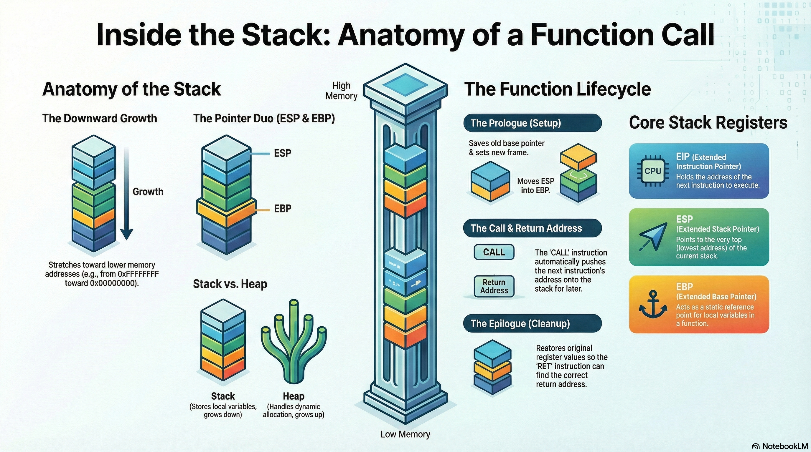

# Lesson 08: The Stack and Function Calls

## Table of Contents

- [Learning Objectives](#learning-objectives)
- [Media Resources](#media-resources)
- [1. Memory Layout: The Stack vs. The Heap](#1-memory-layout-the-stack-vs-the-heap)
- [2. Key Stack Registers](#2-key-stack-registers)
- [3. Function Calls and Return Mechanics](#3-function-calls-and-return-mechanics)
- [4. Stack Frame Management: Prologue and Epilogue](#4-stack-frame-management-prologue-and-epilogue)
- [5. Caller Cleanup and Security](#5-caller-cleanup-and-security)
- [Knowledge Check](#knowledge-check)
- [Presentation Cliffnotes](#presentation-cliffnotes)

---

## Learning Objectives

By the end of this lesson, you will be able to:

*   Differentiate between **Stack** and **Heap** memory allocation and growth directions.
*   Identify the roles of the **ESP**, **EBP**, and **EIP** registers in stack management.
*   Explain the step-by-step mechanics of the **CALL** and **RET** instructions.
*   Analyze the **Function Prologue** and **Epilogue** to identify function boundaries.
*   Understand **Caller Cleanup** and the role of **Stack Cookies** in program security.

---

## Media Resources

[🎧 Listen to Audio](assets/08-stack-and-function-calls.m4a)

[Lecture Slides: The Stack and Function Calls](assets/08-stack-and-function-calls.pdf)

---

## 1. Memory Layout: The Stack vs. The Heap

When a program is loaded into memory, it is assigned a virtual address space (in 32-bit systems, this ranges from 0 to 4GB). This space is divided into several sections, most notably the **Stack** and the **Heap**.

*   **The Heap**: Used for dynamic memory allocation (e.g., `malloc` in C). It grows **upward** toward higher memory addresses.
*   **The Stack**: Used for local variables, function arguments, and control flow. It grows **downward** toward lower memory addresses.

Understanding this growth direction is critical when analyzing memory corruption and buffer overflows.

---

## 2. Key Stack Registers

Three primary registers manage the stack and execution flow in a 32-bit architecture:

*   **ESP (Extended Stack Pointer)**: Points to the current **top** of the stack. Its value changes constantly as data is pushed onto or popped off the stack.
*   **EBP (Extended Base Pointer)**: Acts as a fixed reference point (the "base") for the current function's stack frame. While ESP moves, EBP remains constant throughout the function, allowing local variables and arguments to be accessed using consistent offsets (e.g., `[EBP-4]`).
*   **EIP (Instruction Pointer)**: Holds the memory address of the **next instruction** to be executed. Controlling EIP is the primary goal of many exploit techniques.

*(Note: In 64-bit systems, these are referred to as RSP, RBP, and RIP.)*

---

## 3. Function Calls and Return Mechanics

The interaction between the stack and program flow is most visible during function calls.

### Executing a `CALL`
When a `call` instruction is executed:
1.  The address of the **next** instruction (the return address) is **pushed** onto the stack.
2.  **EIP** is updated to the address of the target function, and execution jumps there.

### Executing a `RET` (Return)
When a function finishes:
1.  The `ret` instruction **pops** the address off the top of the stack.
2.  This address is placed back into **EIP**, returning control to the original caller.

**Critical Risk**: If the stack is misaligned and the top of the stack does not contain the correct return address, the program will likely crash with a segmentation fault.

---

## 4. Stack Frame Management: Prologue and Epilogue

Every function uses a specific set of instructions to safely set up and tear down its own "territory" on the stack, known as a **Stack Frame**.

### The Prologue
Found at the very beginning of a function:
1.  `push EBP`: Saves the caller's base pointer.
2.  `mov EBP, ESP`: Sets the current stack pointer as the new base pointer for this function.

### The Epilogue
Found at the very end of a function:
1.  `mov ESP, EBP`: Resets the stack pointer to the base.
2.  `pop EBP`: Restores the caller's base pointer.
3.  `ret`: Returns to the caller.

---

## 5. Caller Cleanup and Security

### Caller Cleanup
After a function returns, the responsibility for cleaning up arguments often falls to the caller.
*   *Example*: If a caller pushed 4 bytes of arguments before the `call`, you will see `add ESP, 4` immediately after the call returns to restore the stack state.

### Stack Cookies (Stack Guards)
To prevent buffer overflows from overwriting the return address, compilers often insert a **Stack Cookie**.
*   This is a random value placed between local variables and the return address.
*   Before the function returns, the program checks if the cookie is still intact. If it has changed, the program terminates to prevent an exploit.

---

## Knowledge Check

1.  **Which register points to the current "top" of the stack?**
    

    
Answer

    **ESP** (Extended Stack Pointer).
    

2.  **In which direction does the Stack grow in memory?**
    

    
Answer

    **Downward** (towards lower memory addresses).
    

3.  **What two instructions make up a standard function prologue?**
    

    
Answer

    `push EBP` followed by `mov EBP, ESP`.
    

4.  **What instruction is used to return from a function and restore EIP?**
    

    
Answer

    The **RET** (Return) instruction.
    

5.  **Why do analysts look for `add ESP, 4` after a function call?**
    

    
Answer

    It indicates **Caller Cleanup**, where the calling function is removing arguments from the stack that were pushed before the call.
    

6.  **What is the purpose of a Stack Cookie?**
    

    
Answer

    To detect and mitigate **buffer overflows** by ensuring the stack frame hasn't been corrupted before a function returns.
    

---

## Presentation Cliffnotes

*   **The "Anchor" Analogy**: Explain EBP as an anchor. While the "tide" (ESP) goes in and out, the anchor (EBP) stays in one spot so you can find your gear (local variables) easily.
*   **The Breadcrumb**: The return address is like a breadcrumb left on the stack so the CPU can find its way home after the function call is done.
*   **Stack vs. Heap**: Use a visual of two skyscrapers being built—one from the roof down (Stack) and one from the ground up (Heap). They meet in the middle.
*   **Security Context**: Briefly mention that while we study the "ideal" stack, modern security (like Cookies and DEP) makes real-world exploitation much harder.