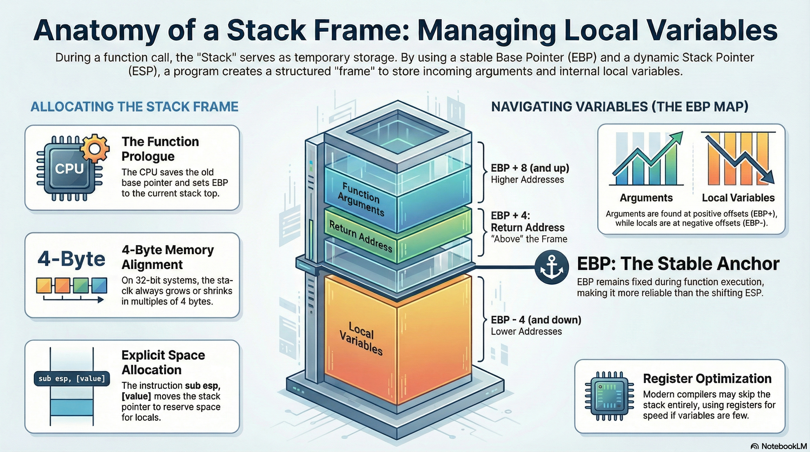
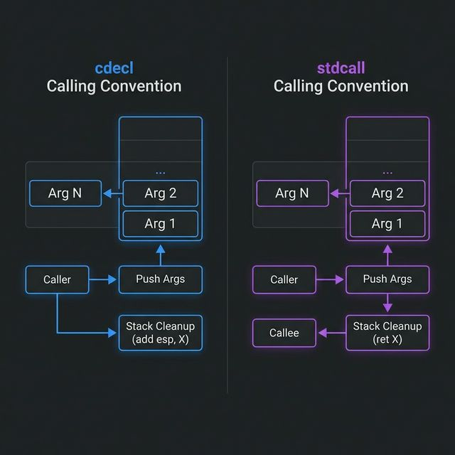

# Lesson 09: Calling Conventions

## Table of Contents

- [Learning Objectives](#learning-objectives)
- [Media Resources](#media-resources)
- [1. What are Calling Conventions?](#1-what-are-calling-conventions)
- [2. The cdecl Convention (C Declaration)](#2-the-cdecl-convention-c-declaration)
- [3. The stdcall Convention (Standard Call)](#3-the-stdcall-convention-standard-call)
- [4. The fastcall Convention](#4-the-fastcall-convention)
- [5. x64 Calling Conventions (Modern Standards)](#5-x64-calling-conventions-modern-standards)
- [Knowledge Check](#knowledge-check)
- [Presentation Cliffnotes](#presentation-cliffnotes)

---

## Learning Objectives

By the end of this lesson, you will be able to:

*   Define **Calling Conventions** and explain why they are necessary for interoperability.
*   Distinguish between **Caller Cleanup** and **Callee Cleanup** in the stack.
*   Identify **cdecl**, **stdcall**, and **fastcall** patterns in 32-bit disassembly.
*   Explain the differences between the **Microsoft x64** and **System V AMD64** (Linux) calling conventions.
*   Locate function **return values** within the EAX/RAX registers.

---

## Media Resources

[🎧 Listen to Audio](assets/09-calling-conventions.m4a)





[Lecture Slides: Calling Conventions](assets/09-calling-conventions.pdf)

---

## 1. What are Calling Conventions?

A **Calling Convention** is a standardized set of rules that governs how functions communicate with each other at the machine level. Without these rules, a program written in C might not be able to call a function in a DLL written in C++, as they might disagree on how to pass data.

Calling conventions define:
*   **Argument Placement**: Are arguments passed on the stack or in registers?
*   **Argument Order**: Are they passed left-to-right or right-to-left?
*   **Stack Cleanup**: Who is responsible for removing arguments from the stack after the call finishes?
*   **Return Values**: Where is the result of the function stored?

---

## 2. The cdecl Convention (C Declaration)

The **cdecl** convention is the default for most C and C++ programs on 32-bit x86 systems.

*   **Argument Passing**: Arguments are pushed onto the **stack**.
*   **Order**: **Right-to-Left** (the last argument is pushed first).
*   **Stack Cleanup**: The **Caller** cleans the stack.
*   **Identification**: You will see an `add ESP, X` instruction immediately *after* the `call` in the parent function.

**Example Assembly:**
```assembly
push 2          ; Arg 2
push 1          ; Arg 1
call _add_numbers
add esp, 8      ; Caller cleans up 8 bytes (2 ints)
```

---

## 3. The stdcall Convention (Standard Call)

The **stdcall** convention is primarily used by the **Windows API** (Win32 API).

*   **Argument Passing**: Arguments are pushed onto the **stack**.
*   **Order**: **Right-to-Left**.
*   **Stack Cleanup**: The **Callee** (the function itself) cleans the stack.
*   **Identification**: The function ends with `ret X`, where X is the number of bytes to pop from the stack.

**Example Assembly:**
```assembly
push 2          ; Arg 2
push 1          ; Arg 1
call _SetWindowTextW
; No stack cleanup here!
...
_SetWindowTextW:
...
ret 8           ; Callee cleans up 8 bytes before returning
```

---

## 4. The fastcall Convention

As the name implies, **fastcall** is designed for speed by minimizing stack operations.

*   **Argument Passing**: The first few arguments (usually 2) are passed in **registers** (typically `ECX` and `EDX`).
*   **Remaining Arguments**: Pushed onto the stack, Right-to-Left.
*   **Stack Cleanup**: Usually **Callee** cleanup.
*   **Identification**: You will see `MOV ECX, [value]` and `MOV EDX, [value]` immediately before a `call`.

**Example Assembly:**
```assembly
mov ecx, 1          ; Arg 1 in ECX
mov edx, 2          ; Arg 2 in EDX
call @add_numbers@8 ; Callee cleans up
```

---

## 5. x64 Calling Conventions (Modern Standards)

In 64-bit architecture, the industry moved away from stack-heavy conventions to favor registers, which are much faster.

### Microsoft x64 (Windows)
*   Uses 4 registers for the first 4 arguments: **RCX, RDX, R8, R9**.
*   **Shadow Space**: The caller must always allocate 32 bytes of "home space" on the stack, even if only registers are used.

### System V AMD64 ABI (Linux / macOS)
*   Uses 6 registers for arguments: **RDI, RSI, RDX, RCX, R8, R9**.
*   This convention is more efficient for functions with many parameters as it stays off the stack longer.

---

## Knowledge Check

1.  **In cdecl, who is responsible for cleaning up the stack?**
    <details>
    <summary>Answer</summary>
    The **Caller** (the function that made the call).
    </details>

2.  **Which register is almost universally used to store a function's return value?**
    <details>
    <summary>Answer</summary>
    **EAX** (in 32-bit) or **RAX** (in 64-bit).
    </details>

3.  **If you see `ret 0xC` at the end of a function, which convention is likely being used?**
    <details>
    <summary>Answer</summary>
    **stdcall** (because the callee is cleaning the stack, and it's popping 12 bytes).
    </details>

4.  **Why does fastcall use ECX and EDX?**
    <details>
    <summary>Answer</summary>
    To avoid the overhead of memory (stack) access, making the function call slightly faster.
    </details>

5.  **Which x64 convention uses the RDI and RSI registers for arguments?**
    <details>
    <summary>Answer</summary>
    **System V AMD64 ABI** (used by Linux and macOS).
    </details>

---

## Presentation Cliffnotes

*   **The "Cleanup" Distinction**: Use the analogy of a party. 
    *   **cdecl**: The host (caller) cleans up after the guests leave.
    *   **stdcall**: The guests (callee) clean up their own mess before they step out the door.
*   **Right-to-Left Logic**: Explain that pushing right-to-left allows for variable argument counts (like `printf`), because the first argument is always at a fixed offset from the top of the stack.
*   **RAX is the Result**: Tell students that if they are lost in a large function, just look at what is in EAX/RAX right before the `ret`—that's usually the "answer" the function is giving back.
*   **Windows vs Linux x64**: Mention that this is one reason why cross-platform reverse engineering can be tricky—even on the same CPU, the "language" of calls changes between OSs.
