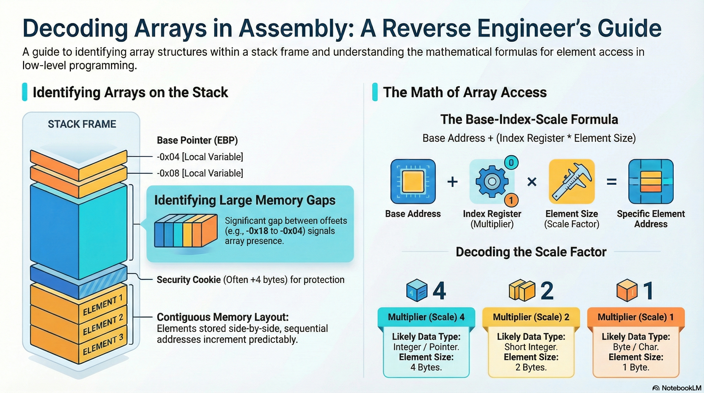

# Lesson 10: Arrays

## Table of Contents

- [Learning Objectives](#learning-objectives)
- [Media Resources](#media-resources)
- [1. Memory and Stack Layout Refresher](#1-memory-and-stack-layout-refresher)
- [2. Identifying Arrays in Assembly](#2-identifying-arrays-in-assembly)
- [3. Calculating the Total Size of an Array](#3-calculating-the-total-size-of-an-array)
- [4. Determining the Size of Individual Elements](#4-determining-the-size-of-individual-elements)
- [5. Using Context to Find the Data Type](#5-using-context-to-find-the-data-type)
- [Knowledge Check](#knowledge-check)
- [Presentation Cliffnotes](#presentation-cliffnotes)

---

## Learning Objectives

By the end of this lesson, you will be able to:

*   Identify **array access patterns** in x86 assembly.
*   Calculate the **total size** of an array based on stack offsets.
*   Determine **individual element sizes** by looking at multiplier registers.
*   Use **contextual clues** (like function calls) to deduce the specific data type stored in an array.

---

## Media Resources

[🎧 Listen to Audio](assets/10-arrays.m4a)

[Lecture Slides: Arrays](assets/10-arrays.pdf)

[📺 Watch Lesson Video](https://youtu.be/yJAVOClWAq4?list=PLHJns8WZXCdvaD7-xR7e5FJNW_6H9w-wC)

---

## 1. Memory and Stack Layout Refresher

Before diving into arrays, it is important to understand how variables are stored on the stack. Local variables are assigned **negative offsets** from the Base Pointer (EBP).

*   **Local Variables**: Often seen as `[ebp - 4]`, `[ebp - 8]`, etc.
*   **Function Arguments**: Assigned **positive offsets**, such as `[ebp + 8]`, `[ebp + 0xC]`.

Arrays follow this same logic but occupy a larger contiguous block of space.

---

## 2. Identifying Arrays in Assembly

Arrays are contiguous blocks of memory addresses. In assembly, you can recognize an array is being accessed when you see instructions calculating a memory location using a **base address plus an offset**.

A typical calculation for accessing an array element inside a loop looks like this:
`EBP + (Counter * Element Size) + Array Base Offset`

*   **Counter**: Often stored in a register like `ECX` or `EAX`. It represents the current array index (0, 1, 2, 3...).
*   **Array Base Offset**: (e.g., `var_18` or `-18 hex`) This tells you where the array begins on the stack relative to EBP.

**Example Instruction:**
`mov eax, [ebp + ecx*4 + var_18]`

---

## 3. Calculating the Total Size of an Array

You can determine how much space an array takes up by checking the difference between the offsets of local variables in the disassembly.

*   **Example**: If an array starts at `EBP - 18h` and the next variable starts at `EBP - 4h`.
*   **Math**: `18h (24 decimal) - 4h (4 decimal) = 14h (20 decimal)`.
*   **Result**: 20 bytes were allocated on the stack for that array.

---

## 4. Determining the Size of Individual Elements

When looking at the assembly instructions, the multiplier used alongside the loop counter reveals the size of each element:

*   **Multiplier of 4** (e.g., `ECX * 4`): Indicates each element is **4 bytes** (standard for integers or memory pointers).
*   **Multiplier of 2** (e.g., `EAX * 2`): Indicates each element is **2 bytes** (usually "short" data types).
*   **Multiplier of 1** (or no multiplier): Indicates **1 byte** elements (characters/strings).

---

## 5. Using Context to Find the Data Type

Simply knowing the element size does not definitively tell you the data type (e.g., a 4-byte element could be a `long`, an `int`, or a `pointer`). You must analyze the surrounding instructions for context.

*   **The Printf Clue**: If an element from a 4-byte array is pushed onto the stack and subsequently used in a `printf` call that uses the `%s` format string, you can deduce that it is an **array of string pointers**.
*   **Arithmetic Clue**: If the elements are being used in floating-point instructions (`FADD`, `FMUL`), the array likely contains `floats` or `doubles`.

---

## Knowledge Check

1.  **What is the standard assembly pattern for accessing an array element?**
    

    
Answer

    `Base Address + (Index * Element Size)`
    

2.  **If an array starts at `EBP - 0x20` and the next variable is at `EBP - 0x10`, what is the total size of the array?**
    

    
Answer

    `0x20 - 0x10 = 0x10` (16 bytes).
    

3.  **In the instruction `mov edx, [ebp + eax*4 + var_20]`, what does the `4` represent?**
    

    
Answer

    The size of each element in the array (4 bytes).
    

4.  **True or False: An element size of 4 bytes always means the array contains integers.**
    

    
Answer

    **False.** It could be an array of pointers, floats, or any other 4-byte data type. You must look at how the data is used (context).
    

---

## Presentation Cliffnotes

*   **Contiguous Memory**: Emphasize that arrays are just one long block. If you overflow one "slot," you're immediately overwriting the next one.
*   **The Math of Indexing**: Walk students through the `[Base + Index * Size]` calculation. Show them that `Index 0` is just the `Base`.
*   **Context is King**: Remind students that assembly doesn't have "types" like C does. It only has "sizes." The "type" is a human concept we reconstruct by looking at what functions (like `printf` or `malloc`) interact with the data.
*   **Stack vs. Heap**: Briefly mention that while this lesson focused on stack arrays, the indexing logic `[Reg + Reg * Scale]` is the same for heap-allocated arrays.